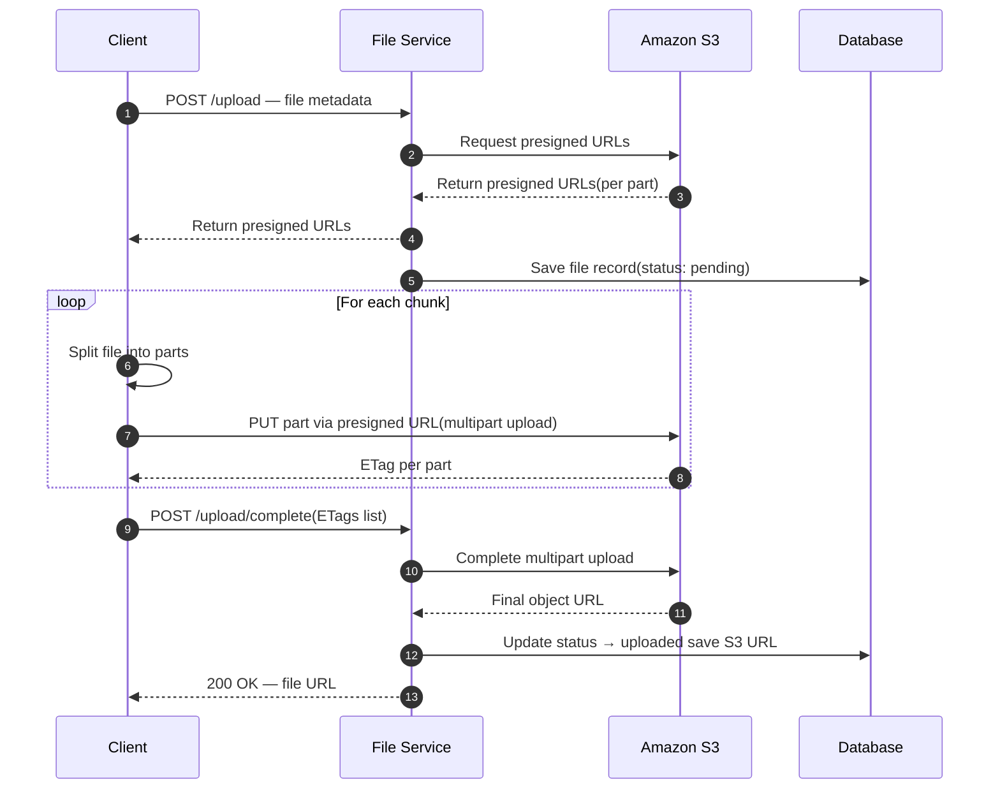

# POC S3 File Manager

Proof of concept para gerenciamento de arquivos com armazenamento em S3.

## Requisitos

### Requisitos funcionais


| ID    | Requisito            | Descrição                                                                            |
| ----- | -------------------- | ------------------------------------------------------------------------------------ |
| RF-01 | Upload de arquivos   | O sistema deve permitir o envio de arquivos para o armazenamento.                    |
| RF-02 | Download de arquivos | O sistema deve permitir a recuperação e o download de arquivos previamente enviados. |


### Requisitos não funcionais


| ID     | Requisito          | Descrição                                                                                                                                                                                     |
| ------ | ------------------ | --------------------------------------------------------------------------------------------------------------------------------------------------------------------------------------------- |
| RNF-01 | Uploads retomáveis | Os uploads devem ser retomáveis: em caso de interrupção (falha de rede, timeout, fechamento da sessão), o envio deve poder continuar de onde parou, sem reenviar o arquivo inteiro do início. |


RF-01



## Configuração AWS S3

A API usa **Amazon S3** (SDK `@aws-sdk/client-s3`). Não é necessário MinIO nem `S3_ENDPOINT` no `.env`.

### 1. Criar o bucket

1. Console [Amazon S3](https://s3.console.aws.amazon.com/) → **Criar bucket**
2. Escolha um nome único (ex.: `poc-s3-file-manager-seu-nome`)
3. Anote a **região** (ex.: `sa-east-1` — São Paulo)

### 2. Usuário IAM e chaves

1. Console [IAM](https://console.aws.amazon.com/iam/) → **Usuários** → **Criar usuário**
2. Anexe uma política com acesso ao bucket (exemplo mínimo):

```json
{
  "Version": "2012-10-17",
  "Statement": [
    {
      "Effect": "Allow",
      "Action": [
        "s3:PutObject",
        "s3:GetObject",
        "s3:DeleteObject",
        "s3:AbortMultipartUpload",
        "s3:ListMultipartUploadParts"
      ],
      "Resource": "arn:aws:s3:::SEU-BUCKET/*"
    }
  ]
}
```

3. Aba **Credenciais de segurança** → **Criar chave de acesso** → copie **ID** e **chave secreta**

### 3. Variáveis no `.env`

Copie `.env.example` para `.env` e preencha:

| Variável | Origem |
|----------|--------|
| `AWS_REGION` | Região do bucket no console S3 |
| `S3_BUCKET` | Nome do bucket |
| `AWS_ACCESS_KEY_ID` | IAM → chave de acesso |
| `AWS_SECRET_ACCESS_KEY` | IAM → chave secreta (só na criação) |

**Opcional:** omita `AWS_ACCESS_KEY_ID` e `AWS_SECRET_ACCESS_KEY` se a API rodar com perfil `aws configure` ou IAM Role (EC2/ECS/Lambda).

**Não use** `S3_ENDPOINT` nem `S3_FORCE_PATH_STYLE` na AWS.
