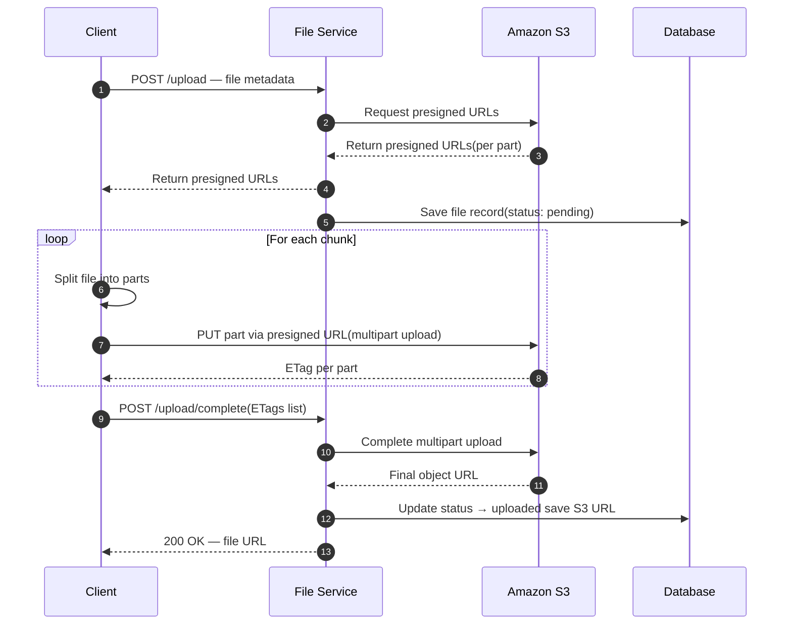

# POC S3 File Manager

Proof of concept para gerenciamento de arquivos com armazenamento em S3.

## Requisitos

### Requisitos funcionais

| ID    | Requisito            | Descrição                                                                            |
| ----- | -------------------- | ------------------------------------------------------------------------------------ |
| RF-01 | Upload de arquivos   | O sistema deve permitir o envio de arquivos para o armazenamento.                    |
| RF-02 | Download de arquivos | O sistema deve permitir a recuperação e o download de arquivos previamente enviados. |

### Requisitos não funcionais

| ID     | Requisito          | Descrição                                                                                                                                                                                     |
| ------ | ------------------ | --------------------------------------------------------------------------------------------------------------------------------------------------------------------------------------------- |
| RNF-01 | Uploads retomáveis | Os uploads devem ser retomáveis: em caso de interrupção (falha de rede, timeout, fechamento da sessão), o envio deve poder continuar de onde parou, sem reenviar o arquivo inteiro do início. |

RF-01

